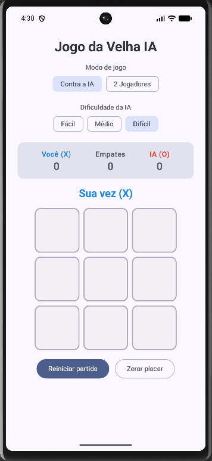

# Jogo da Velha IA

Jogo da velha (Tic-Tac-Toe) para Android, feito em **Kotlin** com **Jetpack Compose**. Você pode jogar contra uma IA com três níveis de dificuldade ou contra outra pessoa no mesmo aparelho.

## Captura de tela

<p align="center">
  
</p>

## Funcionalidades

- **Dois modos de jogo**
  - **Contra a IA**: você joga com X e a IA com O.
  - **2 Jogadores**: duas pessoas jogam no mesmo aparelho.
- **Três níveis de dificuldade**
  - **Fácil**: a IA escolhe jogadas aleatórias.
  - **Médio**: a IA vence quando pode, bloqueia quando precisa e, fora isso, joga aleatoriamente.
  - **Difícil**: a IA usa **Minimax com poda alfa-beta**, joga perfeitamente e nunca perde.
- **Placar da sessão** separado para cada modo (vitórias de X, vitórias de O e empates).
- **Alternância de quem começa** a cada nova partida.
- Destaque da linha vencedora e uma pequena pausa antes da jogada da IA.

## Como a IA funciona (modo Difícil)

O algoritmo Minimax explora todas as jogadas possíveis e pontua cada estado final do ponto de vista da IA:

| Resultado | Pontuação |
|-----------|-----------|
| Vitória da IA | `10 - profundidade` (prefere vencer rápido) |
| Derrota da IA | `profundidade - 10` (prefere adiar a derrota) |
| Empate | `0` |

A poda alfa-beta descarta ramos que não podem mudar o resultado, o que deixa a busca mais rápida. Quando há várias jogadas igualmente boas, a IA sorteia uma delas para não ficar previsível.

## Estrutura do projeto

```
app/src/main/java/com/example/jogodavelhaia/
├── MainActivity.kt    # Ponto de entrada do app
├── TicTacToe.kt       # Interface em Jetpack Compose
├── GameViewModel.kt   # Estado da partida, turnos, placar e agendamento da IA
├── GameLogic.kt       # Tabuleiro, jogadores, modos e detecção de vencedor
├── TicTacToeAI.kt     # IA (aleatória, heurística e Minimax)
└── ui/theme/          # Cores, tipografia e tema
```

## Tecnologias

- Kotlin
- Jetpack Compose + Material 3
- AndroidX ViewModel + Coroutines
- JUnit (testes unitários)

## Requisitos

- Android Studio (versão recente)
- Android 7.0 (API 24) ou superior

## Como executar

1. Clone o repositório:
   ```bash
   git clone https://github.com/vitorcorreiareis/JogoDaVelhaIA.git
   ```
2. Abra a pasta no Android Studio.
3. Aguarde a sincronização do Gradle.
4. Execute o app em um emulador ou em um dispositivo físico.

Pela linha de comando:

```bash
./gradlew assembleDebug   # gera o APK de debug
./gradlew test            # executa os testes unitários
```

## Testes

Os testes em `app/src/test/.../TicTacToeAITest.kt` verificam a detecção de vencedor e o comportamento da IA em cada dificuldade, por exemplo se o modo Médio vence ou bloqueia quando deve e se o modo Difícil nunca perde.
